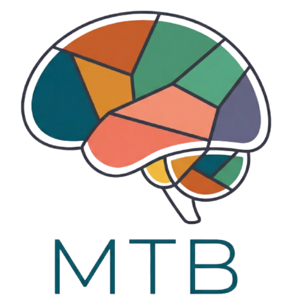

  

# Multi Task Battery (MTB)

A flexible Python toolbox for running multi-domain cognitive and motor tasks during fMRI sessions — all within a single scanning run. Built on [PsychoPy](https://www.psychopy.org/)

This project runs multi-task batteries developed by the diedrichsenlab.
#### Authors: Diedrichsenlab (Bassel Arafat, Caroline Nettekoven, Ince Husain, Ladan Shahshahani, Suzanne Witt, Maedbh King, Jorn Diedrichsen)

If you use the toolbox please cite the following reference:

Arafat, B., Nettekoven, C., Xiang, J. D., & Diedrichsen, J. (2026). Multi-Task Batteries for Functional Precision Mapping. *bioRxiv*, 2026-03.

## Documentation

Full documentation is hosted at:  
https://multitaskbattery.readthedocs.io/

Covers:
- Installation and setup
- Task and run configuration
- Optimal battery selection
- Data output

---

## License

MIT License © 2024 Joern Diedrichsen

---

## Contributing

Open to issues and pull requests. If you use MTB in your research.

---

## Citation

_A publication describing MTB is forthcoming._ Please cite this GitHub repository and relevant task sources.