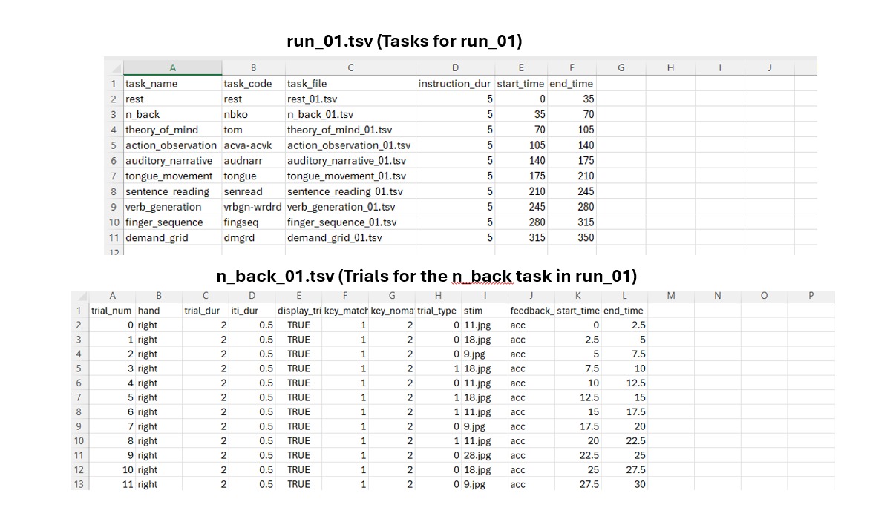

Example Experiment
========================

For this demo, we will run an experiment with predefined run and task files. You can explore the run and task files in the `task_files` and `run_files` directories to see what tasks are included in the experiment.

Run & task files
^^^^^^^^^^^^^^^^^^^

Step 1: Constants.py
-------------------------------------
Verify that the `constants.py` file is filled in with the necessary information. For example you can change the screen resolution, response keys, and other settings as needed.

Step 2: run.py
-------------------------------------
Adjust the subject_id input to the main function to match the subject ID you want to use.

Step 3: Run the Experiment
---------------------------
Execute the script in `run.py` . Output files will be saved in the `data` folder using the subject ID as part of the filename.

Step 4: GUI
---------------------------
A GUI prefilled with information about the current run from constants.py and the subject ID will appear. You can verify the information and click the "Ok" button to start the experiment.

GUI
^^^^^^^^^^^^^^^^^^^
.. image:: images/Run_GUI.png
   :width: 600

If "Wait for TTL Pulse?" is ticked in the GUI, the experiment will wait for a TTL pulse before starting the experiment. If "Wait for TTL Pulse?" is not ticked, the experiment will start immediately.

