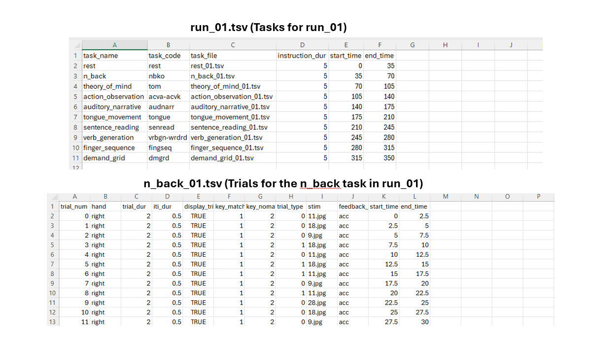
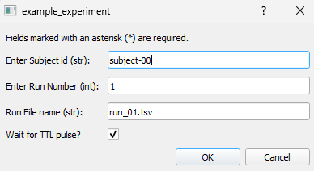

Getting Started
===============

Repository Structure
--------------------
The repository is organized into the following main folders:

- **MultiTaskBattery**: Contains the core Python modules and classes needed to run tasks.
- **stimuli**: Stores the stimuli used in experiments, organized into subfolders for each task (e.g., `n_back` for n-back tasks).
- **experiments**: Stores experiment-specific folders, each containing the necessary configuration and scripts.

::

|-MultiTaskBattery: Main Python modules and classes
|-Stimuli: Stimuli used in the experiment
|  |-n_back: Stimuli for n_back tasks
|     |- ...
|-experiments: Folder for each experiment
|  |- example_experiment: Specific Experiment (example)
|     |-run.py: Your main Python program
|     |-constants.py: Constants for the experiment setup / scanner
|     |-run_files: Files specifying which tasks are done in which run (and which order)
|     |-task_files: Files specifying which trials are done for each task block
|     |-data: Data files for each subject

Implemented tasks
-----------------

The task that are implemented in the repository are listed in the ``task_table.tsv`` file in the `MultiTaskBattery` folder. For more details, see the :ref:`task descriptions <task_descriptions>` .

.. csv-table:: List of tasks
   :file: task_table_for_docs.tsv
   :header-rows: 1
   :delim: tab

Run and Task Files
------------------

The experiment operates on two levels of control: *run files* and *task files*. 

- **Run files (`run_xx.tsv`)**: These files specify the sequence of tasks within each run, including their order and timing. We recommend running each task for 30-40 seconds in a randomized order to ensure a balanced design.

- **Task files (`task_xx.tsv`)**: These files define the precise trial sequence for each task, including the stimuli and any relevant parameters.

Below are examples from the `experiments/example_experiment/run_files` and `experiments/example_experiment/task_files` folders illustrating the relationship between run and task files:

constants.py
------------

The `constants.py` file in the `experiments/example_experiment/` folder contains all the essential configurations required to set up and run the experiment. Below are the key components:

- **Experiment Name**: 
  The `exp_name` variable specifies the name of the experiment.

- **Response Keys**: 
  The `response_keys` variable defines the keys used for responses. Different configurations are provided for scanner-based and local(behavioral) setups.

- **Directory Paths**:
  - `exp_dir`: Base directory for the experiment.
  - `task_dir`: Directory containing task files (`task_xx.tsv`).
  - `run_dir`: Directory containing run files (`run_xx.tsv`).
  - `data_dir`: Directory where data files are saved.
  - `stim_dir`: Directory storing stimuli for tasks.

- **Default Run File**:
  The `default_run_filename` specifies the default run file (`run_01.tsv`) used in the experiment.

- **Eye-Tracking**:
  The `eye_tracker` flag enables or disables eye tracking integration.

- **Debug Mode**:
  Set `debug` to `True` to enable debugging features.

- **Screen Settings**:
  The `screen` dictionary allows customization of the screen resolution (`screen['size']`), full-screen mode (`screen['fullscr']`), and display selection (`screen['number']`).

run.py
------
The `run.py` script in the `example_experiment/` folder serves as the main program for running the experiment. It controls the entire process, from initialization to data saving. Below are its key components:

- **Experiment Initialization**:  
  The `Experiment` object is created using configurations defined in `constants.py`.

- **Run Confirmation**:  
  A GUI prompts the user to confirm the run details. The GUI looks like this:

- **Run Initialization**:  
  The run file (`run_xx.tsv`) is loaded, and task objects are initialized based on the specified tasks and their sequence using the task files (`task_xx.tsv`).

- **Run Execution**:  
  Tasks are executed in the specified order and with the defined timing, as per the run file and using trial information from the task files.

- **Data Saving**:  
  Upon completion, the experimental data is saved in the `data` folder under a filename that includes the subject ID entered in the GUI.

Running the Example Experiment
------------------------------

The `example_experiment` includes the following tasks:

- Finger Sequence  
- n-back  
- Demand Grid  
- Auditory Narrative  
- Sentence Reading  
- Verb Generation  
- Action Observation  
- Tongue Movement  
- Theory of Mind  
- Rest  

To run the `example_experiment`, follow these steps:

1. **Configure `constants.py`**:  
   Ensure the file `experiments/example_experiment/constants.py` is properly configured. Adjust settings such as screen resolution, response keys, and other parameters as needed to match your experiment's requirements.

2. **Run the Experiment**:  
   Execute the `run.py` script located in `experiments/example_experiment/run.py`. The output files will be saved in the `data` folder, with filenames that include the subject ID provided during the experiment.

