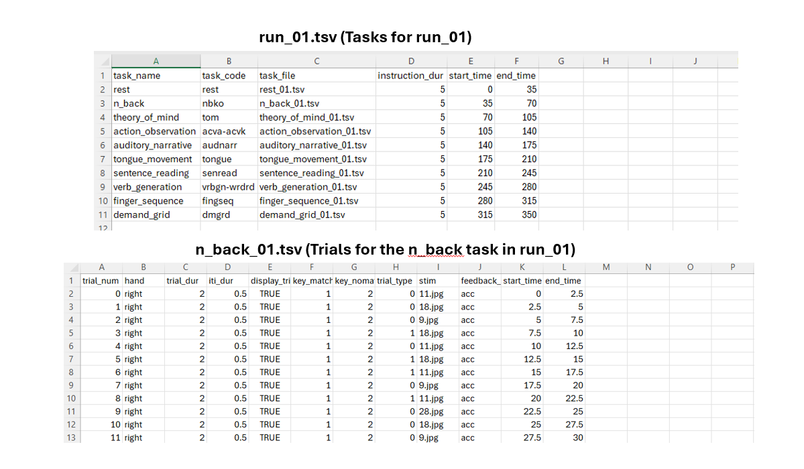
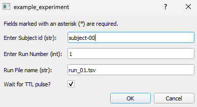

Getting Started
===============

Repository Structure
--------------------
The repository is organized into the following main folders:

- **MultiTaskBattery**: Contains the core Python modules and classes needed to run tasks.
- **stimuli**: Stores the stimuli used in experiments, organized into subfolders for each task (e.g., `n_back` for n-back tasks).
- **experiments**: Stores example experiments that you can use as a starting point. Your own experiment should live in its own folder **outside** the repository (not inside ``experiments/``), so that updates to MultiTaskBattery never interfere with your work.

::

    |-MultiTaskBattery: Main Python modules and classes
    |-stimuli: Stimuli used in the experiments
    |  |-n_back: Stimuli for n_back tasks
    |     |- ...
    |-experiments: Example experiments to use as a starting point
    |  |- example_minimal: Minimal experiment using only built-in tasks
    |  |   |-run.py: Main Python program
    |  |   |-constants.py: Experiment / scanner configuration
    |  |   |-run_files: Files specifying which tasks are done in which run (and which order)
    |  |   |-task_files: Files specifying which trials are done for each task block
    |  |   |-data: Data files for each subject
    |  |- example_custom_task: Same as example_minimal, plus locally defined custom tasks
    |      |-my_tasks.py: Custom Task and TaskFile classes for this experiment
    |      |-task_table.tsv: Local task table extending the framework's
    |      |- ... (same other files as example_minimal)

Implemented tasks
-----------------

The tasks implemented in the repository are listed in the ``task_table.tsv`` file in the ``MultiTaskBattery`` folder. For more details, see the :ref:`task descriptions <task_descriptions>`.

.. task-summary-table::

Run and Task Files
------------------

The experiment operates on two levels of control: *run files* and *task files*.

- **Run files (`run_xx.tsv`)**: These files specify the order and timing of tasks within each run. Each task starts with an 5s instruction period, followed by 30s task performance. While longer task periods are possible, we recommend 30-40 s to ensure that each task can run once during each run. Furthermore, we strongly recommend a randomized order of tasks across run to to ensure a balanced design.

- **Task files (`task_xx.tsv`)**: These files define the precise trial sequence for each task, including the condition, stimuli and any other relevant parameters. The exact format of these files strongly depends on the task.

Below are examples from the `experiments/example_minimal/run_files` and `experiments/example_minimal/task_files` folders illustrating the relationship between run and task files:

While run files and task files can be generated by hand, the :ref:`task_file.py module <Task_file Module>` contains code to generate these automatically with customizable input parameters.

Run file columns
^^^^^^^^^^^^^^^^

Each run file (``run_xx.tsv``) has one row per task block, with these columns:

- ``task_name``: Name of the task (matches the ``name`` column in ``task_table.tsv``).
- ``task_code``: Short code for the task (from ``task_table.tsv``).
- ``task_file``: Name of the task file holding the trials for this block.
- ``instruction_dur``: Duration of the instruction screen before the block (in seconds).
- ``start_time`` / ``end_time``: When the block starts and ends, relative to the start of the run (in seconds).

Task file columns
^^^^^^^^^^^^^^^^^

Task files (``task_xx.tsv``) have one row per trial. The exact set of columns varies from task to task. This section explains what the **shared** columns mean; for the complete, authoritative list of columns for any given task, see that task's entry on the :ref:`task descriptions <task_descriptions>` page.

*Always present (every task):*

- ``trial_num``: Trial number.
- ``trial_dur``: Duration of the trial (in seconds).
- ``start_time``: When the trial starts, relative to the start of the task (in seconds).
- ``end_time``: When the trial end, relative to the start of the task (in seconds).

*Present for most tasks:*

- ``iti_dur``: Inter-trial interval duration (in seconds). Absent for tasks with no gap between trials (e.g. ``rest``).
- ``display_trial_feedback``: Whether to show feedback (a green/red fixation cross) after the trial.
- ``stim``: The stimulus presented — e.g. an image filename, a word, or an audio file. Present whenever the task shows a named stimulus.
- ``hand``: Which hand responds (``left``, ``right``, or ``bimanual``). Present whenever the task collects a manual response.

*Response-key columns:*
Tasks that collect a button press include one column per response option, named after what the option means. The exact names depend on the task's answer space — for example ``key_one`` … ``key_four`` (a generic four-choice task such as RMET or Finger Sequence), ``key_true`` / ``key_false`` (Theory of Mind), ``key_match`` / ``key_nomatch`` (n-back), or ``key_pleasant`` / ``key_unpleasant`` (Affective).

*Condition / trial-type columns:*
A task may also record a ``condition`` and/or a ``trial_type`` column. These two are easy to confuse, so they are explained in their own section just below.

Each task also has its own task-specific columns. To know exactly which columns a given task's file needs — the shared ones above plus any task-specific ones — consult the **Task file columns** table in that task's entry on the :ref:`task descriptions <task_descriptions>` page, which lists every column for that task.

Tasks vs. conditions
^^^^^^^^^^^^^^^^^^^^

- **Task** — are the task itself (e.g. ``n_back``, ``movie``, ``reading``). Each task is one row in ``task_table.tsv`` and runs in separate 30s-block in a run after an instructions.
- **Condition** — is a specific variant of a task, encoded in the task_file in the ``condition`` column. Example: ``movie`` → ``romance``; ``reading`` → ``sentences``.

For each task block, you have two choices:

- you can run all trials within the task block in one single condition. If you want to include multiple conditions of the task in your experiment, you would add two blocks of the same task in the imaging run - one in condition A and one in condition
- you can also add trials of both conditions in the task file for a single task block. For example, the first 15s of a task block could be ``reading`` → ``sentences`` and the second 15s could b ``reading`` → ``non-words``. In the GLM modeling the two phases of the task block would be modelled separately.

Note that some tasks have trials of different **trial types**, which usually are modelled together as one condition in the GLM. block.

The **Task file columns** table in each task's entry on the :ref:`task descriptions <task_descriptions>` page shows which (if any) of these columns a task uses, and what its values mean.

constants.py
------------

The `constants.py` file in the `experiments/example_minimal/` folder contains all the essential configurations required to set up and run the experiment. Below are the key components:

- **Experiment Name**:
  The `exp_name` variable specifies the name of the experiment.

- **Response Keys**:
  The `response_keys` variable defines the keys used for responses. Different configurations are provided for scanner-based and local(behavioral) setups.

- **Directory Paths**:
  - `exp_dir`: Base directory for the experiment.
  - `task_dir`: Directory containing task files (`task_xx.tsv`).
  - `run_dir`: Directory containing run files (`run_xx.tsv`).
  - `data_dir`: Directory where data files are saved.
  - `stim_dir`: Directory storing stimuli for tasks.

- **Default Run File**:
  The `default_run_filename` is the run-file name template (`run_{}.tsv`); the `{}` is auto-filled with the run number in the GUI (e.g. `run_01.tsv`, `run_02.tsv`, ...).

- **Eye-Tracking**:
  The `eye_tracker` flag enables or disables eye tracking integration.

- **Debug Mode**:
  Set `debug` to `True` to enable debugging features.

- **Screen Settings**:
  The `screen` dictionary allows customization of the screen resolution (`screen['size']`), full-screen mode (`screen['fullscr']`), and display selection (`screen['number']`).

run.py
------
The `run.py` script in the `example_minimal/` folder serves as the main program for running the experiment. It controls the entire process, from initialization to data saving. Below are its key components:

- **Experiment Initialization**:
  The `Experiment` object is created using configurations defined in `constants.py`.

- **Run Confirmation**:
  A GUI prompts the user to confirm the run details. The GUI looks like this:

- **Run Initialization**:
  The run file (`run_xx.tsv`) is loaded, and task objects are initialized based on the specified tasks and their sequence using the task files (`task_xx.tsv`).

- **Run Execution**:
  Tasks are executed in the specified order and with the defined timing, as per the run file and using trial information from the task files.

- **Data Saving**:
  Upon completion, the experimental data is saved in the `data` folder under a filename that includes the subject ID entered in the GUI.

Running the Example Experiments
-------------------------------

The repository includes two example experiments:

- **example_minimal** — uses only built-in tasks from the shared MultiTaskBattery package. Start here.
- **example_custom_task** — same structure as `example_minimal`, but also defines two local custom tasks (in ``my_tasks.py``) and registers them via ``task_modules`` in ``constants.py``. Use this as a reference when you want to add your own tasks without editing the shared package. See :doc:`creating_tasks` for the full pattern.

The `example_minimal` experiment includes the following tasks:

- Finger Sequence
- n-back
- Demand Grid
- Auditory Narrative
- Sentence Reading
- Verb Generation
- Action Observation
- Tongue Movement
- Theory of Mind
- Rest

To run `example_minimal`, follow these steps:

1. **Configure `constants.py`**:
   Ensure the file `experiments/example_minimal/constants.py` is properly configured. Adjust settings such as screen resolution, response keys, and other parameters as needed to match your experiment's requirements.

2. **Generate run and task files**:
   Run `experiments/example_minimal/make_files.py` to generate the run and task files. This creates the `.tsv` files in `run_files/` and `task_files/` that define the task order and trial sequences. The example experiment comes with pre-generated files, but for a new experiment you must run this step first.

3. **Run the Experiment**:
   Execute the `run.py` script located in `experiments/example_minimal/run.py`. The output files will be saved in the `data` folder, with filenames that include the subject ID provided during the experiment.

Feedback
--------
For some tasks you will receive immediate feedback about your performance during the task. For correct responses, the fixation cross will turn green and when you made a mistake it will turn red. For other tasks you will see how you did at the end of the run. You will see a scoreboard with your performance on each task and a summary of your performance across all runs.

.. image:: images/feedback.png
   :width: 600
