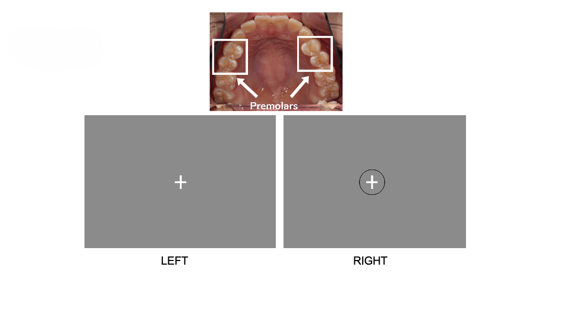
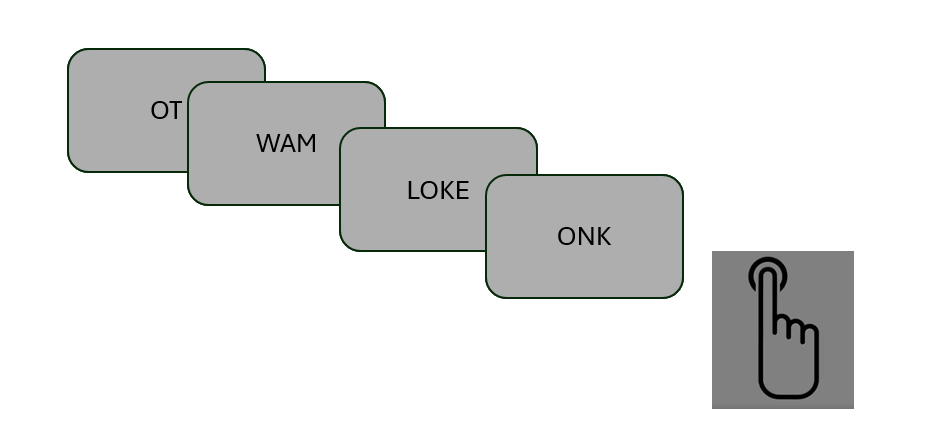
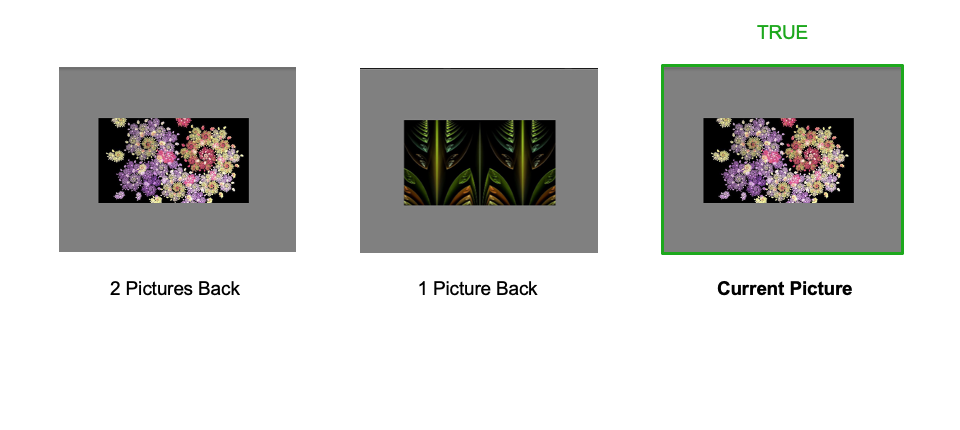
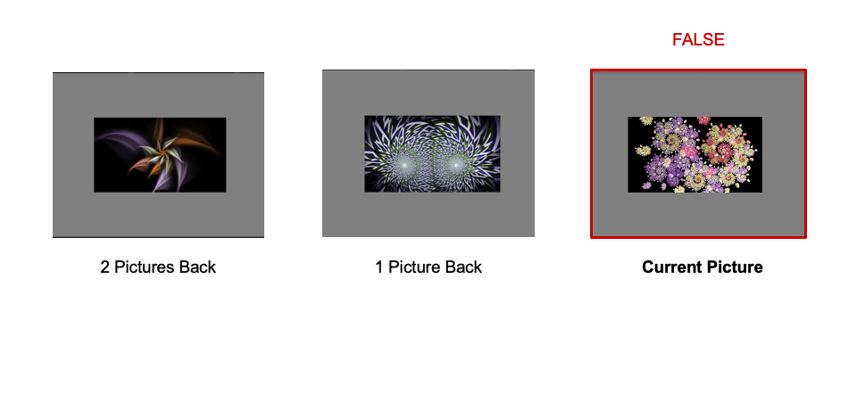
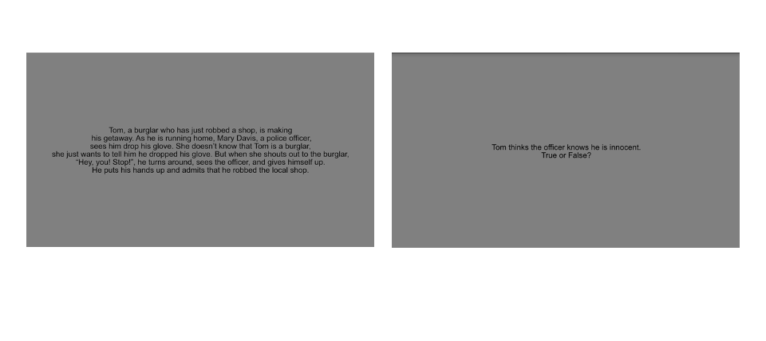

Experiment Instructions 
=============================

Training procedure
--------------------------------

* consent
* demographics (in paper file) -> participants.tsv

General Instructions
----------------------------------

Scanner
^^^^^^^^^^^^^^^
.. image:: images/Slide16.png
   :width: 600
   
This is the scanner. It consists of a strong magnet (the big ring) which collects images of your brain. You will lie on the table which we will move into the big magnet so that your head is right inside the scanner.
As you are being moved into the scanner, at the beginning you can experience some sensations that are due to your body getting used to the strong magnetic field. This can include dizzyness or feeling like the room is very slowly spinning. It can also include a metallic taste. These sensations will stop after a few seconds. We will wait until you are comfortable and happy inside the scanner before beginning with the scan. It is normal to feel a bit confined in the scanner, so try to focus on your breathing, close your eyes for a bit if that helps you or look at the projector if that is better for you. When you are being put inside the scanner you are welcome to adjust your position so that you are as comfortable as possible throughout the scan.

Movement
^^^^^^^^^^^^^^^

Importance of lying still
"""""""""""""""""""""""""""

   
Please stay as still as possible in the scanner. The images we are collecting from your brain are very sensitive to motion. At the top you can see what an image without motion looks like and below that the same image collected when the participant moved. On the right you can see a scan that was very badly affected by motion. The images are so sensitive that we can see submillimeter movements that you are doing (like on the left).

Tips for lying still in the scanner
""""""""""""""""""""""""""""""""""""""""

   
There are a few things you can do to reduce movement in the scanner.

* If you notice anything vaguely uncomfortable before you get rolled into the magnet, tell the experimenter. Things that are slightly uncomfortable at the start become excruciating by the end. Once you are in place, you will maintain that exact position for a couple hours.
* Try not to change head or body position during a scan (while the magnet is beeping). If the head moves, it creates artifacts that are usually difficult if not impossible to fix. The position of body parts in the magnetic field distorts it. So if you cross your legs, scratch your head, open your mouth, yawn (inhale deeply), or shift your posture, it can lead to artifacts even if your brain doesn't move. We try to keep runs as short as possible (ideally under 5 minutes) so that you can stay in the same position the whole time.
* Swallowing can lead to head motion artifacts. If you can avoid swallowing during a scan, the data quality will be better. If trying not to swallow makes you gag or swallow suddenly, then it's best to just swallow normally at ~random times. Do not try to time your swallowing with the events in the experiment (e.g., waiting until a series of trials is over).
* Between scans (when the magnet is not beeping), you can swallow and make small adjustments to your body posture (e.g., scratch your face or adjust your legs). Try not to make any large movements that would affect your head position.
* Try to stay relaxed throughout the session. If you tense up at the beginning of a scan, your head can drift as you settle down. We will warn you 20-30 seconds before the scanner starts beeping so you will not be alarmed by the sudden noise.
* If you notice anything unusual with the stimuli (e.g., they're upside down or you can't see the display or the screen saver comes on partway through a scan) or have problems with the task (e.g., make mistakes, fall asleep), be sure to tell the experimenter after the scan in which it happened.
* You will be given a squeeze ball in case you need to stop the scan midway. You can use this if something goes wrong with the stimuli or if you need to stop immediately.

We know that this is very hard, especially when you are focussing on a task. This is why we are going to make you as comfortable as possible when we put you into the scanner. You can have as much padding around the head, your shoulders and your arms as you like. When you hear us talking to you through the intercom, try not to jerk or move around (sometimes we do this almost without being aware).
We will give you a bit of medical sticky tape on your forehead that will give you tactile feedback when you move, to help you know when you are moving.
Try to use these tips to reduce your movement in the scanner, especially when images are being collected (during the task and when before and after the task when we tell you we are recording an image).
But we want you to be as comfortable as possible in the scanner, so don’t torture yourself! Experience shows that comfortable and relaxed participants give the best data, so generally try to lie still but don’t obsess over it :)

Button Box
^^^^^^^^^^^^^^^
.. image:: images/Slide2.png
   :width: 600
   
This is the button box. We will give to you before you go into the scanner. You will use this to respond to the tasks. You will use your index finger to respond ‘yes’, your middle finger to respond ‘no’ and your ring finger to indicate that you want to talk to us. We will give you a cushion for the button box so that it doesn’t move around on your lap while you are doing the task.
We will talk to you after every scan and every run of the task to see how you are doing and to tell you what is going to happen next.
We want to enable you to be as still as possible and talking can make the head move uncosciously. So if you are comfortable with this, we ask you to respond to us when we ask how you are doing using the button box instead of talking.
Use the index finger for responding with ‘Yes’, the middle finger for ‘No’ and use the ring finger to say that you want to talk to us.
We will also give you an emergency call bell. You can use this whenever you want while you’re in the scanner. If you press the emergency call bell we will immediately stop the scan and talk to you to see what is wrong. In such a situation of course feel free to talk so we can see immediately what’s wrong and take you out of the scanner if necessary.

Task Instructions
----------------------------------

Finger Sequence
^^^^^^^^^^^^^^^
.. image:: images/Slide3.png
   :width: 600
   
This is a movement task. You will have 5 seconds to respond to a sequence of six numbers (comprised of 1,2,3,4).
  
Toe Flexion
^^^^^^^^^^^^^^^
.. image:: images/Slide4.png
   :width: 600
   
This is a toe movement task. You will flex and extend your toes. When the screen says 'fled', then pull your toes towards you. When it says 'extend', extend your toes away from you, like you're tip-toeing. Try to keep the rest of your body as still as possible while you do this so that you don’t move your head. Try also to match the pace of the instruction.
  
Tongue Movement
^^^^^^^^^^^^^^^

   
This is a tongue movement task. You will move your tongue from left to right in your closed mouth. Your will either touch your left upper premolar teeth or your right upper premolar teeth. The premolar teeth are shown in the image. A black circle flashing on and off around the fixation cross while tell you when to touch left or right. When you see the black circle on, touch your right upper premolar teeth. When it is off, touch your left premolar teeth. Try to keep the rest of your body as still as possible while you do this so that you don’t move your head. 

.. Sentence Prediction
.. ^^^^^^^^^^^^^^^
.. .. image:: images/SemanticPrediction.png
..    :width: 600
   
.. This is the sentence prediction task. On the screen you will see a series of words that form a sentence. The last word will be missing. Try to complete the sentence with the last word in your head, but without saying it or moving your lips or tongue in any way.

Verb Generation
^^^^^^^^^^^^^^^
.. image:: images/Slide22.png
   :width: 600
   
This is the verb generation task. On the screen you will see a a noun. Try to think of a verb that is something you can do with the noun. For example, when seeing 'computer', think of 'type'. Or think of something that the noun does. For example when seeing 'lion' think of 'roar'. Think the first verb that comes to mind and try not to move your tongue or lips while you do this.

NonWord Reading
^^^^^^^^^^^^^^^

   
This is the nonword reading task. On the screen you will see a series of words that don't exist in the English language. Read the words silently in your head, but without saying it or moving your lips or tongue in any way. Every few words we will ask you to press the button box to indicate that you are still paying attention. When you see the symbol on the right, press any button.

Sentence Reading
^^^^^^^^^^^^^^^^^^
.. image:: images/Slide24.png
   :width: 600
   
This is the sentence reading task. On the screen you will see a series of words that form a sentence. Read the sentence silently in your head, but without saying it or moving your lips or tongue in any way. After every sentence we will ask you to press the button box to indicate that you are still paying attention. When you see the symbol on the right, press any button.

Auditory Narrative
^^^^^^^^^^^^^^^^^^^
.. image:: images/Slide25.png
   :width: 600
   
This is the auditory narrative task. You will be listening to a story that is told to you via the headphones. Try to follow the story and imagine the scenes that are being described. Try to imagine the characters, the setting, the objects that are being described. Try to imagine the story as vividly as possible. In each run, you will hear a bit more of the story. Try to follow along the narrative across runs.

Intact Passage
^^^^^^^^^^^^^^^
.. image:: images/Slide26.png
   :width: 600
   
This is the intact passage task. You will be listening to passages of different stories or snippets of conversations. The conversations and stories will have nothing to do with each other. Listen attentively and try to understand what is being said.

Degraded Passage
^^^^^^^^^^^^^^^^^^^

   
This is the degraded passage task. You will be listening to passages of different stories or snippets of conversations. The sound quality of the stories and conversations will be degraded. Listen attentively and try to understand what is being said.

Spatial Navigation
^^^^^^^^^^^^^^^^^^^
.. image:: images/Slide28.png
   :width: 600
   
In this task, you should imagine walking from room to room in childhood home. We will tell you which room you should start your walk in and which room to end in. Every time you do this task, you will start at a different room and end in a different room, so the path will be different. Try to really bring the image to life in your mind. What pictures you see on the walls, what furniture do you pass by, are there any people in the rooms, what does it smell like?

N-Back
^^^^^^^^^^^^^^^

   

This is the N-Back task. This is a task of working memory. On the screen you will be presented with a series of letters (either A, B or C). Whenever you see that the current letter on the screen is the same as the letter 2-letters ago, make your response. For example, you may see A, then B, then A again, when you see that second A make your response indicating that A matches the letter that you saw two trials ago.

Theory of Mind
^^^^^^^^^^^^^^^

   
.. image:: images/Slide11.png
   :width: 600
   
In this task, you will read two stories and answer a question after each story presentation. You will have 10 seconds to read the story and 5 seconds to answer a ‘true’ or ‘false’ question about the story. There is a particular strategy to answering these questions, which you will learn with practice”.

Visual Search
^^^^^^^^^^^^^^^
.. image:: images/Slide12.png
   :width: 600
   
.. image:: images/Slide13.png
   :width: 600
   
In this task, you will be asked to rapidly scan a number of letters and identify whether the target letter ‘L’ is present. Each trial will always multiple images of the letter ‘T’. However, on some trials, the letter ‘L’ will also be present among the distracting ‘T’ letters. On each trial, you will have to correctly identify whether the L is present. 

Action Observation
^^^^^^^^^^^^^^^^^^^
.. image:: images/Slide14.png
   :width: 600
   
You are not required to make any response (overt or covert) in this task. You will watch two short video clips of 1) a knot being tied and 2) an already tied knot rotating on an axis. We ask that you pay close attention to the knot-tying exercise and the finished product as well as the name of each knot (upper right side of screen) as we will quiz you after the scanning experiment and ask you to tie the knot yourself”.

Romance Movie
^^^^^^^^^^^^^^^^^^^
.. image:: images/Slide7.png
   :width: 600
   
You are not required to make any response (overt or covert) in this task. You will watch short video clips of of an animated movie.

Feedback
^^^^^^^^^^^^^^^^^^^
.. image:: images/Slide15.png
   :width: 600
   
For some of the tasks you will receive immediate feedback about your performance during the task. For correct responses, the fixation cross will turn green and when you made a mistake it will turn red. For other tasks you will see how you did at the end of the run. You will see a scoreboard with your performance on each task. You will also see a summary of your performance across all runs. Have a quick look at the scoreboard on the right and tell me if you have any questions about what it shows.

Instructions for the experimenter
----------------------------------
1) The participant will be presented with feedback at the end of each run. By the end of the run, the participant should be scoring above 85% on each task. The theory of mind task is an exception to this rule. As there are only two trials in this task, a score of 50% is permissible.
2) If you observe that the participant has scored poorly on certain tasks (i.e. no sign of improvement across blocks, below 85% at the end of the run) then you should ask the participant to practice the task again. Don’t forget to increase the run-number by one if you execute additional runs that not specified in the task design spreadsheet.
3) Be sure to talk through the results with the participant and ask them whether they found any tasks particularly difficult. Specifically, enquire 1) whether they encountered any difficulty in generating verbs 2) whether they would be able to identify the knots that they had seen 3) whether they were able to navigate from room-to-room in their childhood home – what did they focus on, colours, smells, objects, people? 4) what they imagined when they were playing tennis – did they focus on their own body movements, how prominent was the tennis-ball in their reflections – was the other person very present?
4) In addition, ask participants whether there were any particular strategies that they were using for the tasks. Walk them through each of the tasks and ask them how they managed to maintain at-ceiling (near perfect) performance.
