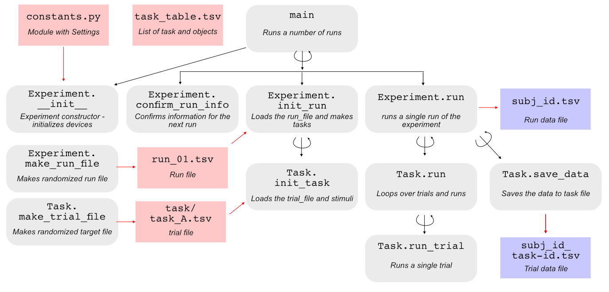

Overview
========

Repository Structure 
--------------------

The repository has the following Structure: 

| -experiment_code: Main Python classes for Experiment task
| -stimuli: Stimuli used in the experiment 
|
| -pontine_7T: Specific Experiment (exanple)
|  |-pontine_7T.py: main program
|  |-run_files: Files specifying which tasks are done in which run 
|  |-target_files: Files specifying which trials are done for each task block
|  |-data: Data files for each subject

Program Structure
-----------------

Your main program will create and experiment object - with all settings specified in the constants.py file. 

.. code-block:: python

    import constants as const
    my_Exp = exp_block.Experiment(const, subj_id=subj_id)

    while True:
        my_Exp.confirm_run_info()
        my_Exp.init_run()
        my_Exp.run()
    return

``confirm_run_info()`` will ask the user to confirm the run information. 
``init_run()`` will read the run_file and then create the task objects, which in turn will read the trial files.  

``Experiment.run()`` will run a run of the experiment, which then calls ``Task.run()``, which then calls ``Task.run_trial()``. For most tasks, only the latter function needs to be defined. 

