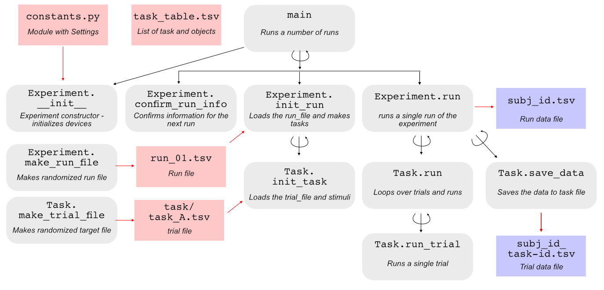

API reference
-------------

Overview
^^^^^^^^

The main function will create an Experiment object, will all the settings specified in the constants.py file.

``Experiment.confirm_run_info()`` will ask the user to confirm the run information.

``Experiment.init_run()`` will read the run_file and then create the task objects, which in turn will read the trial files. Run and task files are created before the experiment starts, using the specification in your make_files.py module.

``Experiment.run()`` will finally run a run of the experiment, calling ``Task.run()`` for each task in the right moment, which then calls ``Task.run_trial()``. For most tasks, only the latter function needs to be defined. The data for each task will be collected and saved in the file <subj_id>_<task_id>.tsv in the data folder. The actual timing of the different tasks in each run are stored in the <subj_id>.tsv file.

.. toctree::
   :maxdepth: 2

   reference_exp.rst
   reference_task_blocks.rst
   reference_task_file.rst
   reference_screen.rst
   reference_clock.rst
   reference_utils.rst

