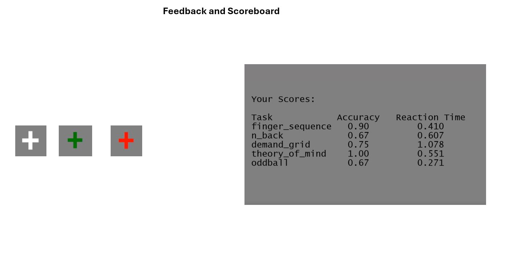

Task Descriptions
-----------------

.. _task_descriptions:

The following tasks are available in the MultiTaskBattery. Each task entry shows its description, available conditions, and reference where applicable.

.. task-descriptions::

Feedback
^^^^^^^^^^^^^^^^^^^

For some of the tasks you will receive immediate feedback about your performance during the task. For correct responses, the fixation cross will turn green and when you made a mistake it will turn red. For other tasks you will see how you did at the end of the run. You will see a scoreboard with your performance on each task. You will also see a summary of your performance across all runs. Have a quick look at the scoreboard on the right and tell me if you have any questions about what it shows.
