Task Descriptions
-----------------

.. _task_descriptions:

Action Observation
^^^^^^^^^^^^^^^^^^^
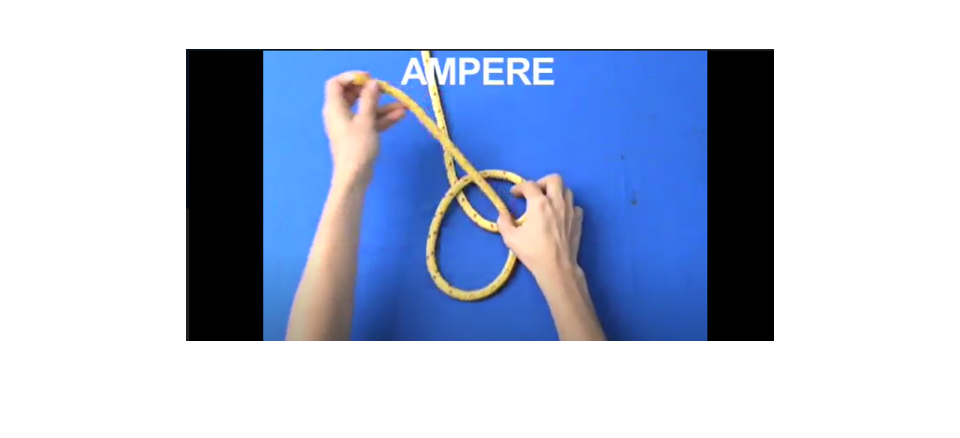
   
You are not required to make any response (overt or covert) in this task. You will watch two short video clips of 1) a knot being tied and 2) an already tied knot rotating on an axis. We ask that you pay close attention to the knot-tying exercise and the finished product as well as the name of each knot (upper right side of screen) as we will quiz you after the scanning experiment and ask you to tie the knot yourself”.

Arithmetic
^^^^^^^^^^^^^^^^^^^
.. image:: images/Slide34.png
   :width: 600
   
In this task, you will indicate if a simple multiplication equation is correct or incorrect.

Auditory Narrative
^^^^^^^^^^^^^^^^^^^

   
This is the auditory narrative task. You will be listening to a story that is told to you via the headphones. Try to follow the story and imagine the scenes that are being described. Try to imagine the characters, the setting, the objects that are being described. Try to imagine the story as vividly as possible. In each run, you will hear a bit more of the story. Try to follow along the narrative across runs.

Degraded Passage
^^^^^^^^^^^^^^^^
.. image:: images/Slide27.png
   :width: 600
   
This is the degraded passage task. You will be listening to passages of different stories or snippets of conversations. The sound quality of the stories and conversations will be degraded. Listen attentively and try to understand what is being said.

Demand Grid
^^^^^^^^^^^

   
In this task, you will see 3 pairs of squares light up in a 3x4 grid.  You will need the choose the grid that represents the combination of all 3 pairs.
This task is flexible. Paratmeters like grid size, num of steps and num of boxes shown in each step can be changed.

Finger Sequence
^^^^^^^^^^^^^^^
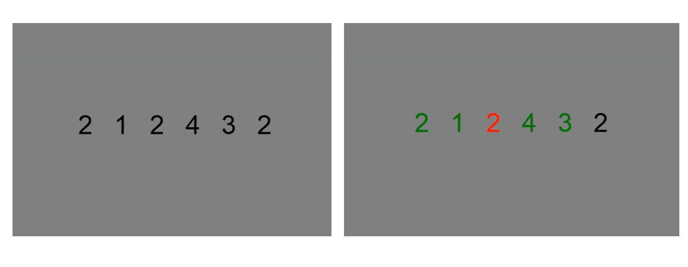
   
This is a movement task. You will have 5 seconds to respond to a sequence of six numbers (comprised of 1,2,3,4).

Flexion Extension
^^^^^^^^^^^^^^^^^
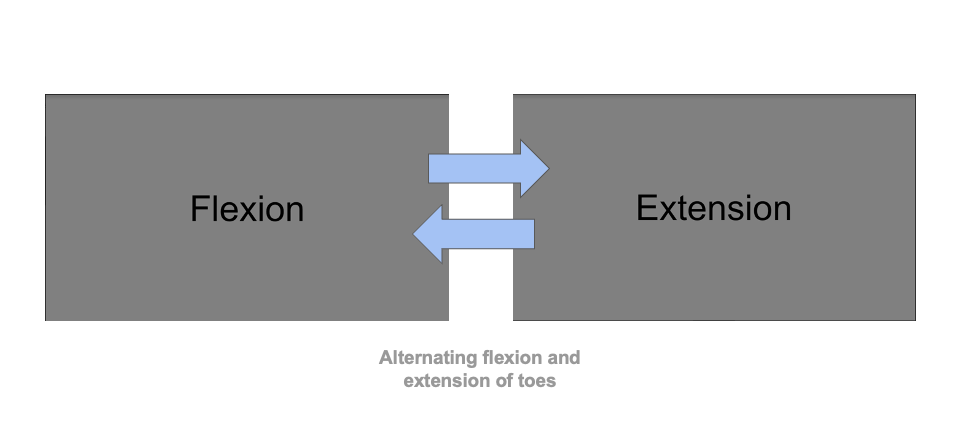
   
This is a toe movement task. You will flex and extend your toes. When the screen says 'fled', then pull your toes towards you. When it says 'extend', extend your toes away from you, like you're tip-toeing. Try to keep the rest of your body as still as possible while you do this so that you don’t move your head. Try also to match the pace of the instruction.

Intact Passage
^^^^^^^^^^^^^^

   
This is the intact passage task. You will be listening to passages of different stories or snippets of conversations. The conversations and stories will have nothing to do with each other. Listen attentively and try to understand what is being said.

N-Back
^^^^^^^^^^^^^^^
.. image:: images/Slide5.png
   :width: 600
   
.. image:: images/Slide6.png
   :width: 600

This is the N-Back task. This is a task of working memory. On the screen you will be presented with a series of images on the screen. Whenever you see that the current image on the screen is the same as the image presented 2 images ago, make a 'True' response. If the image is not the same as the image shown 2 images ago make a 'False' response.

Nonword Reading
^^^^^^^^^^^^^^^
.. image:: images/Slide23.png
   :width: 600
   
This is the nonword reading task. On the screen you will see a series of words that don't exist in the English language. Read the words silently in your head, but without saying it or moving your lips or tongue in any way. Every few words we will ask you to press the button box to indicate that you are still paying attention. When you see the symbol on the right, press any button.

Oddball
^^^^^^^^^^^^^^^^^^^

   
In this task, you will a red "K", black "K", red "O" or black "O".  You will need to press when you see a red "K".

Rest
^^^^^^^^^^^^^^^^^^^

   
Look at a fixation cross.

Romance Movie
^^^^^^^^^^^^^^^^^^^
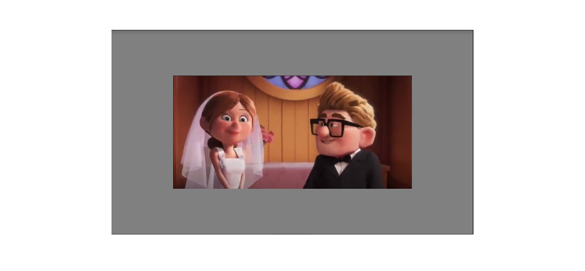
   
You are not required to make any response (overt or covert) in this task. You will watch short video clips of of an animated movie.

Sentence Reading
^^^^^^^^^^^^^^^^^^
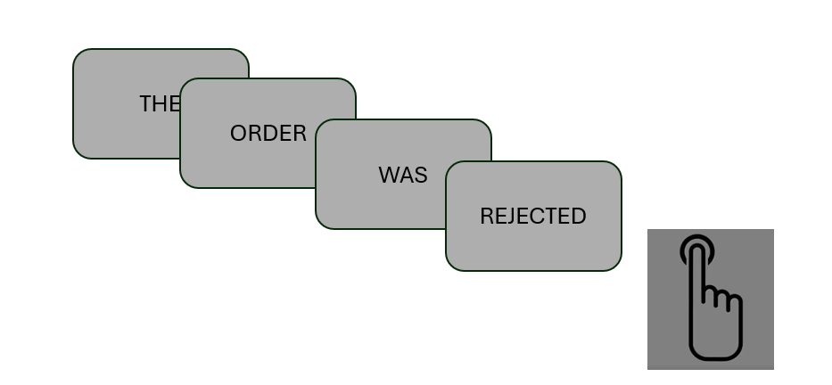
   
This is the sentence reading task. On the screen you will see a series of words that form a sentence. Read the sentence silently in your head, but without saying it or moving your lips or tongue in any way. After every sentence we will ask you to press the button box to indicate that you are still paying attention. When you see the symbol on the right, press any button.

Spatial Navigation
^^^^^^^^^^^^^^^^^^^
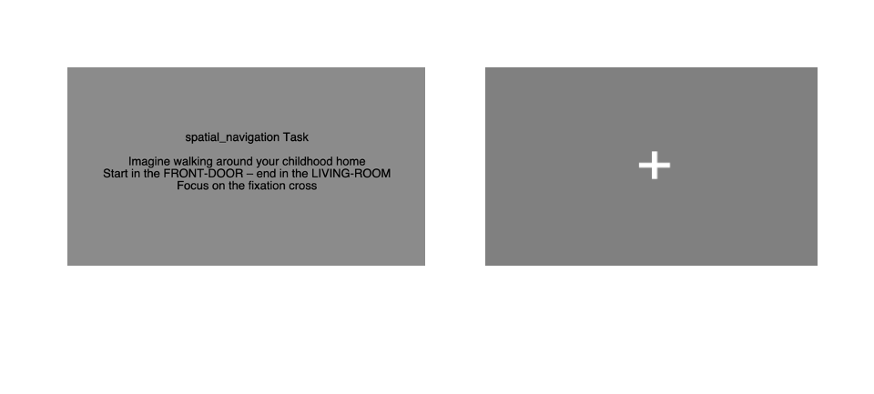
   
In this task, you should imagine walking from room to room in childhood home. We will tell you which room you should start your walk in and which room to end in. Every time you do this task, you will start at a different room and end in a different room, so the path will be different. Try to really bring the image to life in your mind. What pictures you see on the walls, what furniture do you pass by, are there any people in the rooms, what does it smell like?

Theory of Mind
^^^^^^^^^^^^^^^
.. image:: images/Slide10.png
   :width: 600
   
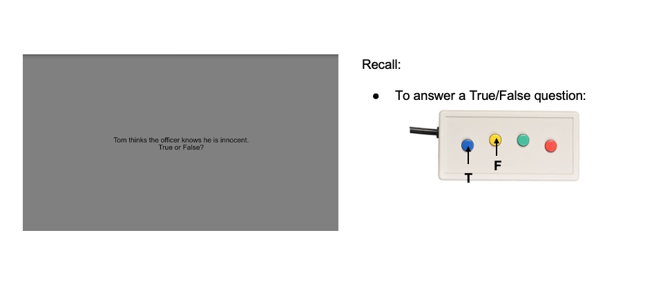
   
In this task, you will read two stories and answer a question after each story presentation. You will have 10 seconds to read the story and 5 seconds to answer a ‘true’ or ‘false’ question about the story. There is a particular strategy to answering these questions, which you will learn with practice”.

Tongue Movement
^^^^^^^^^^^^^^^
.. image:: images/Slide21.png
   :width: 600
   
This is a tongue movement task. You will move your tongue from left to right in your closed mouth. Your will either touch your left upper premolar teeth or your right upper premolar teeth. The premolar teeth are shown in the image. A black circle flashing on and off around the fixation cross while tell you when to touch left or right. When you see the black circle on, touch your right upper premolar teeth. When it is off, touch your left premolar teeth. Try to keep the rest of your body as still as possible while you do this so that you don’t move your head. 

Verb Generation
^^^^^^^^^^^^^^^
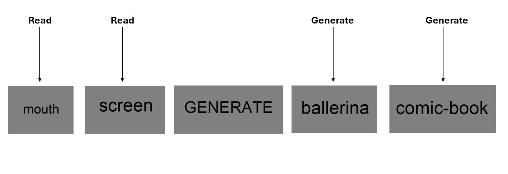
   
This is the verb generation task. On the screen you will see a a noun. Try to think of a verb that is something you can do with the noun. For example, when seeing 'computer', think of 'type'. Or think of something that the noun does. For example when seeing 'lion' think of 'roar'. Think the first verb that comes to mind and try not to move your tongue or lips while you do this.

Verbal-2-Back
^^^^^^^^^^^^^^^
.. image:: images/Slide32.png
   :width: 600

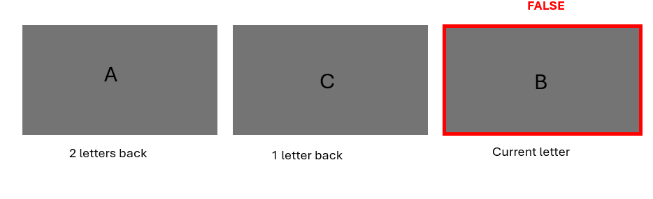
   
This is the Verbal-2-Back task. This is a task of working memory. On the screen you will be presented with a series of letters (either A, B or C). Whenever you see that the current letter on the screen is the same as the letter 2-letters ago, make your response. For example, you may see A, then B, then A again, when you see that second A make your response indicating that A matches the letter that you saw two trials ago.

Visual Search
^^^^^^^^^^^^^^^
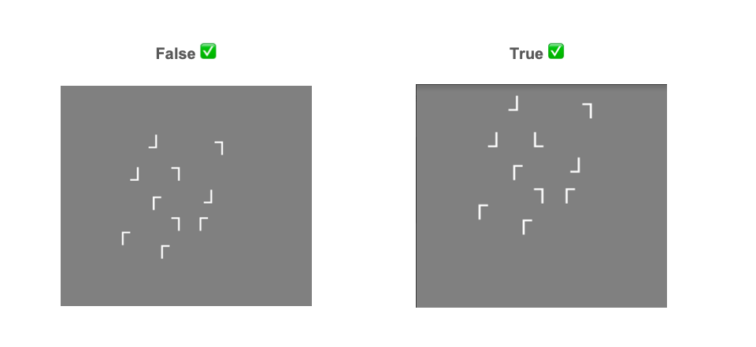
   
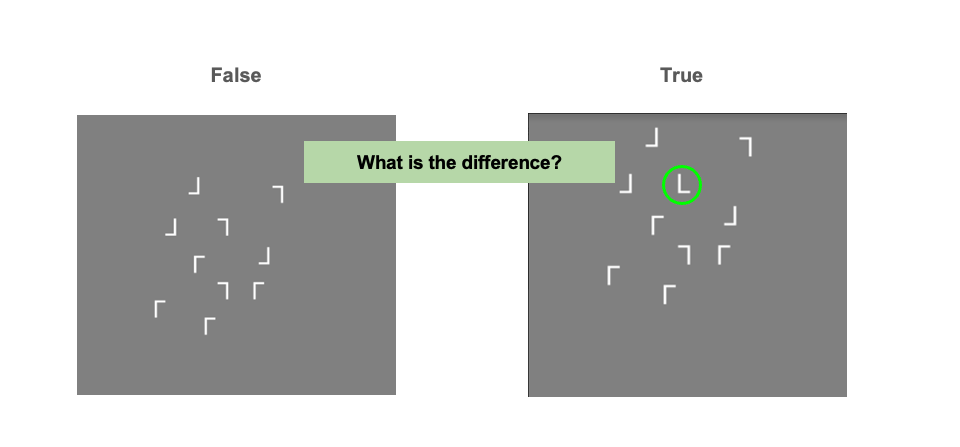
   
In this task, you will be asked to rapidly scan a number of letters and identify whether the target letter ‘L’ is present. Each trial will always multiple images of the letter ‘T’. However, on some trials, the letter ‘L’ will also be present among the distracting ‘T’ letters. On each trial, you will have to correctly identify whether the L is present. 

Feedback
^^^^^^^^^^^^^^^^^^^
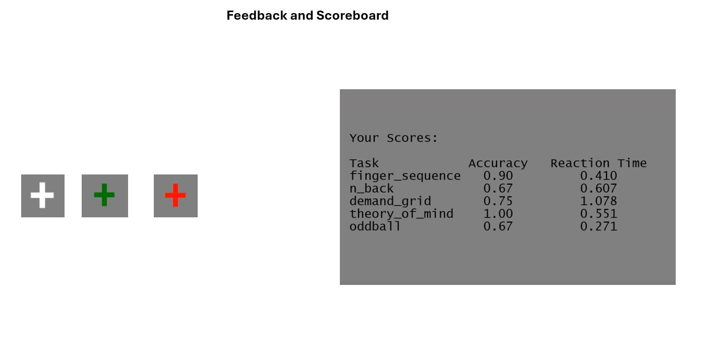
   
For some of the tasks you will receive immediate feedback about your performance during the task. For correct responses, the fixation cross will turn green and when you made a mistake it will turn red. For other tasks you will see how you did at the end of the run. You will see a scoreboard with your performance on each task. You will also see a summary of your performance across all runs. Have a quick look at the scoreboard on the right and tell me if you have any questions about what it shows.
